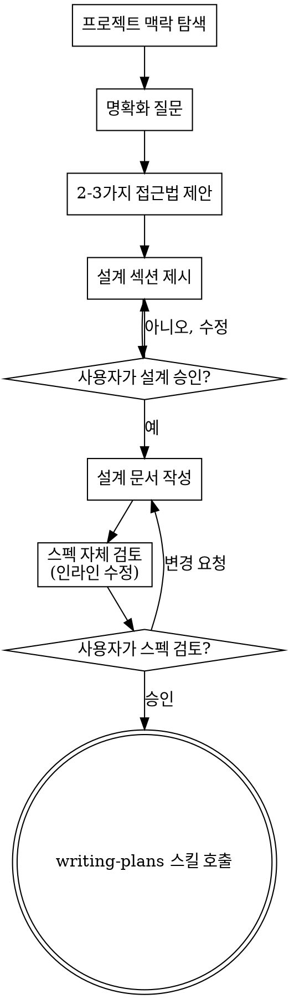

# 아이디어를 설계로 발전시키는 Brainstorming

자연스러운 협업 대화를 통해 아이디어를 완전한 설계와 스펙으로 발전시키는 과정임.

현재 프로젝트 맥락을 먼저 파악한 다음, 아이디어를 다듬기 위해 질문을 하나씩 제시함. 무엇을 만들지 이해한 후 설계를 제안하고 사용자 승인을 받음.

<HARD-GATE>
설계를 제시하고 사용자가 승인할 때까지 구현 스킬 호출, 코드 작성, 프로젝트 스캐폴딩, 또는 어떠한 구현 행동도 하지 않음. 이는 단순해 보이는 프로젝트를 포함한 모든 프로젝트에 적용됨.
</HARD-GATE>

## 안티패턴: "이건 너무 간단해서 설계가 필요 없어"

모든 프로젝트는 이 과정을 거침. 할 일 목록, 단일 함수 유틸리티, 설정 변경 — 모두 해당됨. "단순한" 프로젝트야말로 검토되지 않은 가정이 가장 많은 낭비를 초래하는 곳임. 설계는 짧아도 됨(정말 단순한 프로젝트는 몇 문장으로 충분), 하지만 반드시 제시하고 승인을 받아야 함.

## 체크리스트

아래 항목 각각에 대해 작업을 생성하고 순서대로 완료해야 함:

1. **프로젝트 맥락 탐색** — 파일, 문서, 최근 커밋 확인
2. **명확화 질문** — 하나씩, 목적/제약/성공 기준 파악
3. **2-3가지 접근법 제안** — 트레이드오프와 권장 사항 포함
4. **설계 제시** — 복잡도에 맞게 섹션별로 나누어 제시, 각 섹션 후 사용자 승인 획득
5. **설계 문서 작성** — `_workspaces/{branch-slug}/design.md`에 저장 후 커밋
6. **스펙 자체 검토** — 플레이스홀더, 모순, 모호성, 범위에 대한 빠른 인라인 점검 (아래 참조)
7. **사용자의 작성된 스펙 검토** — 진행 전 사용자에게 스펙 파일 검토 요청
8. **구현으로 전환** — writing-plans 스킬을 호출하여 구현 계획 작성

## 프로세스 흐름

**최종 상태는 writing-plans 호출임.** frontend-design, mcp-builder, 또는 다른 구현 스킬을 호출하지 않음. brainstorming 후 호출하는 스킬은 writing-plans 하나뿐임.

## 프로세스

**아이디어 이해:**

- 먼저 현재 프로젝트 상태를 확인함 (파일, 문서, 최근 커밋)
- 세부 질문 전에 범위를 먼저 파악함: 요청이 여러 독립적인 서브시스템을 묘사하는 경우 (예: "채팅, 파일 저장, 결제, 분석이 있는 플랫폼 구축"), 즉시 이를 알림. 먼저 분해가 필요한 프로젝트의 세부 사항을 다듬는 데 질문을 소모하지 않음.
- 프로젝트가 단일 스펙에 비해 너무 크다면, 사용자가 서브 프로젝트로 분해할 수 있도록 도와줌: 독립적인 구성 요소는 무엇인지, 어떻게 연관되는지, 어떤 순서로 만들어야 하는지? 그런 다음 첫 번째 서브 프로젝트를 일반 설계 흐름으로 brainstorming함. 각 서브 프로젝트는 자체적인 스펙 → 계획 → 구현 사이클을 가짐.
- 적절한 범위의 프로젝트는 아이디어를 다듬기 위해 질문을 하나씩 제시함
- 가능하면 객관식 질문을 선호하지만, 주관식도 괜찮음
- 메시지당 질문 하나 — 주제에 더 많은 탐색이 필요하다면 여러 질문으로 나눔
- 목적, 제약 조건, 성공 기준 이해에 집중함

**접근법 탐색:**

- 트레이드오프를 포함한 2-3가지 다른 접근법을 제안함
- 권장 사항과 이유를 포함하여 대화형으로 옵션을 제시함
- 권장 옵션을 먼저 제시하고 이유를 설명함

**설계 제시:**

- 무엇을 만들지 이해했다고 판단되면 설계를 제시함
- 각 섹션을 복잡도에 맞게 조정함: 간단하면 몇 문장, 복잡하면 200-300단어까지
- 각 섹션 후 지금까지 괜찮은지 확인함
- 다음 내용을 다룸: 아키텍처, 컴포넌트, 데이터 흐름, 에러 처리, 테스트
- 이해되지 않는 부분이 있으면 언제든지 돌아가서 명확히 할 준비를 함

**격리와 명확성을 위한 설계:**

- 시스템을 각각 하나의 명확한 목적을 가지고, 잘 정의된 인터페이스로 소통하며, 독립적으로 이해하고 테스트할 수 있는 더 작은 단위로 분해함
- 각 단위에 대해 답할 수 있어야 함: 무엇을 하는가, 어떻게 사용하는가, 무엇에 의존하는가?
- 내부를 읽지 않고도 단위가 무엇을 하는지 이해할 수 있나요? 소비자를 깨뜨리지 않고 내부를 변경할 수 있나요? 그렇지 않다면 경계를 재검토해야 함.
- 더 작고 경계가 명확한 단위는 작업하기도 더 쉬움 — 한 번에 컨텍스트에 담을 수 있는 코드에 대해 더 잘 추론하고, 파일이 집중되어 있을 때 편집이 더 신뢰할 수 있음. 파일이 커질 때, 그것은 종종 너무 많은 일을 하고 있다는 신호임.

**기존 코드베이스에서 작업:**

- 변경을 제안하기 전에 현재 구조를 탐색함. 기존 패턴을 따름.
- 작업에 영향을 미치는 기존 코드 문제가 있는 경우 (예: 너무 커진 파일, 불명확한 경계, 얽힌 책임), 작업 중인 코드를 개선하는 좋은 개발자처럼 설계의 일부로 목표한 개선을 포함함.
- 관련 없는 리팩터링은 제안하지 않음. 현재 목표에 기여하는 것에 집중함.

## 설계 이후

**문서화:**

- 검증된 설계(스펙)를 `_workspaces/{branch-slug}/design.md`에 작성함
  - (스펙 위치에 대한 사용자 설정이 이 기본값보다 우선함)
- 명확하고 간결하게 작성함
- 설계 문서를 git에 커밋함

**스펙 자체 검토:**
스펙 문서를 작성한 후, 새로운 눈으로 검토함:

1. **플레이스홀더 스캔:** "TBD", "TODO", 불완전한 섹션, 또는 모호한 요구사항이 있나요? 수정함.
2. **내부 일관성:** 섹션들이 서로 모순되지 않나요? 아키텍처가 기능 설명과 일치하나요?
3. **범위 확인:** 단일 구현 계획에 충분히 집중되어 있나요, 아니면 분해가 필요한가요?
4. **모호성 확인:** 요구사항이 두 가지로 해석될 수 있나요? 그렇다면 하나를 선택하고 명시함.

인라인으로 문제를 수정함. 재검토는 불필요 — 수정하고 계속 진행함.

**사용자 검토 게이트:**
스펙 검토 루프가 통과된 후, 진행 전 사용자에게 작성된 스펙을 검토하도록 요청함:

> "스펙을 `<경로>`에 작성하고 커밋함. 검토 후 구현 계획 작성 시작 전 변경하고 싶은 부분 있으면 안내 바람."

사용자의 응답을 기다림. 변경을 요청하면 수정하고 스펙 검토 루프를 다시 실행함. 사용자가 승인한 후에만 진행함.

**구현:**

- writing-plans 스킬을 호출하여 상세 구현 계획을 작성함
- 다른 스킬은 호출하지 않음. writing-plans가 다음 단계임.

## 핵심 원칙

- **한 번에 하나의 질문** — 여러 질문으로 부담을 주지 않음
- **객관식 선호** — 가능하면 주관식보다 답하기 쉬운 객관식을 사용함
- **YAGNI 철저히** — 모든 설계에서 불필요한 기능을 제거함
- **대안 탐색** — 결정 전 항상 2-3가지 접근법을 제안함
- **점진적 검증** — 설계를 제시하고, 계속 진행하기 전에 승인을 받음
- **유연성 유지** — 이해되지 않는 부분이 있으면 돌아가서 명확히 함
