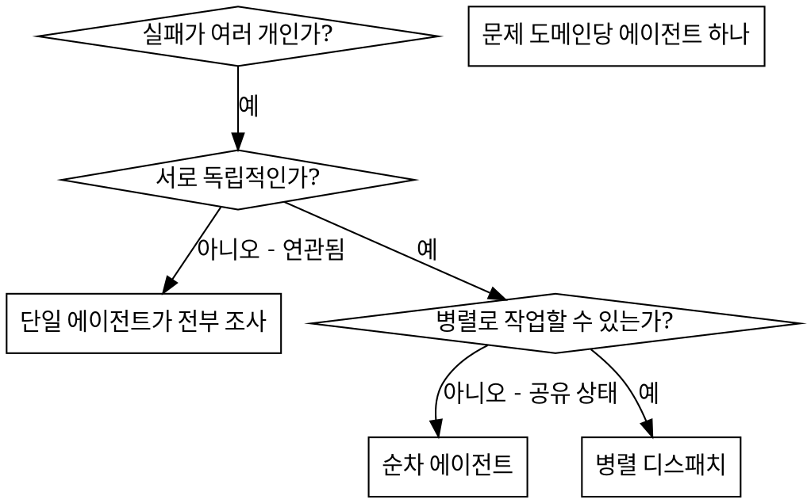

# 병렬 에이전트 디스패치

## 개요

독립적인 컨텍스트를 가진 전문 에이전트들에게 작업을 위임. 에이전트들의 지시사항과 컨텍스트를 정밀하게 구성하여 작업에 집중하고 성공할 수 있도록 보장. 에이전트들은 현재 세션의 컨텍스트나 이력을 절대 물려받지 않아야 함 — 필요한 것만 정확하게 구성하여 전달. 이를 통해 조율 작업을 위한 자체 컨텍스트도 보존 가능.

여러 개의 무관한 실패(다른 테스트 파일, 다른 서브시스템, 다른 버그)가 있을 때, 순차적으로 조사하면 시간이 낭비됨. 각 조사는 독립적이므로 병렬로 진행 가능.

**핵심 원칙:** 독립적인 문제 영역당 에이전트 하나씩 디스패치. 동시에 작업하도록 허용.

## 사용 시점



**사용 시:**

- 서로 다른 근본 원인으로 3개 이상의 테스트 파일 실패
- 여러 서브시스템이 독립적으로 고장
- 각 문제를 다른 문제의 컨텍스트 없이 이해 가능
- 조사 간 공유 상태 없음

**사용 안 함:**

- 실패들이 연관되어 있는 경우 (하나를 고치면 다른 것도 해결될 수 있음)
- 전체 시스템 상태 파악이 필요한 경우
- 에이전트들이 서로 간섭할 수 있는 경우

## 패턴

### 1. 독립적인 도메인 식별

실패를 무엇이 고장났는지에 따라 그룹화:

- 모듈 A 테스트: 도구 승인 흐름
- 모듈 B 테스트: 배치 완료 동작
- 모듈 C 테스트: 중단(abort) 기능

각 도메인은 독립적 — 도구 승인 수정이 중단 테스트에 영향을 주지 않음.

### 2. 집중된 에이전트 작업 생성

각 에이전트에게 제공:

- **구체적인 범위:** 하나의 테스트 파일 또는 서브시스템
- **명확한 목표:** 이 테스트들을 통과시킬 것
- **제약 조건:** 다른 코드 변경 금지
- **예상 출력:** 발견한 내용과 수정 사항 요약

### 3. 병렬 디스패치

```
// 에이전트 디스패치 도구로 세 작업을 동시에 시작
디스패치("모듈 A의 실패 테스트 수정")
디스패치("모듈 B의 실패 테스트 수정")
디스패치("모듈 C의 실패 테스트 수정")
// 세 에이전트가 동시에 실행됨 — 서로의 완료를 기다리지 않음
```

### 4. 검토 및 통합

에이전트가 반환하면:

- 각 요약 읽기
- 수정 사항 충돌 여부 확인
- 전체 테스트 스위트 실행
- 모든 변경 사항 통합

## 에이전트 프롬프트 구조

좋은 에이전트 프롬프트의 조건:

1. **집중됨** — 하나의 명확한 문제 도메인
2. **자급자족** — 문제 이해에 필요한 모든 컨텍스트 포함
3. **출력에 대해 구체적** — 에이전트가 무엇을 반환해야 하는가?

```markdown
중단(abort) 모듈의 실패한 테스트 3개를 수정하세요:

1. "부분 출력을 포착하며 도구를 중단" — 메시지에 '중단 지점' 표시가 포함되어야 하는데 누락됨
2. "완료된 도구와 중단된 도구가 섞인 경우 처리" — 빠른 도구가 완료되지 않고 중단됨
3. "대기 중인 도구 개수를 올바르게 추적" — 결과 3개를 기대했으나 0개

타이밍/경쟁 조건(race condition) 문제로 보입니다. 작업 내용:

1. 테스트 파일을 읽고 각 테스트가 무엇을 검증하는지 파악
2. 근본 원인 식별 — 타이밍 문제인가, 실제 버그인가?
3. 다음 방식으로 수정:
   - 임의의 타임아웃을 이벤트 기반 대기로 교체
   - 중단 구현에 버그가 있으면 수정
   - 검증 대상 동작이 바뀐 경우 테스트 기대값 조정

타임아웃을 늘리는 것으로 때우지 말고 진짜 원인을 찾으세요.

반환: 발견한 내용과 수정한 내용 요약.
```

## 흔한 실수

**❌ 너무 광범위:** "모든 테스트를 고쳐라" — 에이전트가 길을 잃음
**✅ 구체적:** "중단 모듈의 테스트를 고쳐라" — 집중된 범위

**❌ 컨텍스트 없음:** "경쟁 조건을 고쳐라" — 에이전트가 위치를 모름
**✅ 컨텍스트 있음:** 에러 메시지와 테스트 이름을 함께 제공

**❌ 제약 없음:** 에이전트가 모든 것을 리팩터링할 수 있음
**✅ 제약 있음:** "프로덕션 코드는 변경하지 말 것" 또는 "테스트만 수정할 것"

**❌ 모호한 출력:** "알아서 고쳐라" — 무엇이 변경되었는지 알 수 없음
**✅ 구체적:** "근본 원인과 변경 사항 요약을 반환할 것"

## 사용하지 말아야 할 경우

**연관된 실패:** 하나를 고치면 다른 것도 해결될 수 있음 — 먼저 함께 조사
**전체 컨텍스트 필요:** 이해를 위해 전체 시스템을 봐야 하는 경우
**탐색적 디버깅:** 아직 무엇이 고장났는지 모르는 경우
**공유 상태:** 에이전트들이 간섭할 수 있는 경우 (동일 파일 편집, 동일 리소스 사용)

## 실제 세션 예시

**시나리오:** 대규모 리팩터링 후 3개 파일에서 6개 테스트 실패

**실패:**

- 중단(abort) 모듈: 3개 실패 (타이밍 문제)
- 배치 완료 모듈: 2개 실패 (도구가 실행되지 않음)
- 도구 승인 경쟁 조건 모듈: 1개 실패 (실행 횟수 = 0)

**결정:** 독립적인 도메인 — 중단 로직은 배치 완료와 별개, 경쟁 조건과도 별개

**디스패치:**

```
에이전트 1 → 중단 모듈 테스트 수정
에이전트 2 → 배치 완료 모듈 테스트 수정
에이전트 3 → 도구 승인 경쟁 조건 모듈 테스트 수정
```

**결과:**

- 에이전트 1: 타임아웃을 이벤트 기반 대기로 교체
- 에이전트 2: 이벤트 구조 버그 수정 (식별자가 잘못된 위치에 있었음)
- 에이전트 3: 비동기 도구 실행 완료 대기 추가

**통합:** 모든 수정 사항 독립적, 충돌 없음, 전체 스위트 통과

**절약된 시간:** 3개 문제를 순차적이 아닌 병렬로 해결

## 핵심 이점

1. **병렬화** — 여러 조사가 동시에 진행
2. **집중** — 각 에이전트의 범위가 좁아 추적할 컨텍스트 감소
3. **독립성** — 에이전트들이 서로 간섭하지 않음
4. **속도** — 1개 문제 시간에 3개 문제 해결

## 검증

에이전트 반환 후:

1. **각 요약 검토** — 무엇이 변경되었는지 이해
2. **충돌 확인** — 에이전트들이 동일한 코드를 편집했는가?
3. **전체 스위트 실행** — 모든 수정 사항이 함께 작동하는지 확인
4. **샘플 확인** — 에이전트들이 체계적인 오류를 범할 수 있음

## 실제 영향

디버깅 세션(2025-10-03)에서:

- 3개 파일에서 6개 실패
- 3개 에이전트 병렬 디스패치
- 모든 조사 동시 완료
- 모든 수정 사항 성공적으로 통합
- 에이전트 변경 간 충돌 없음
