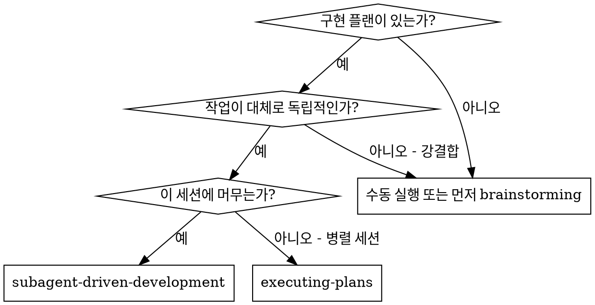
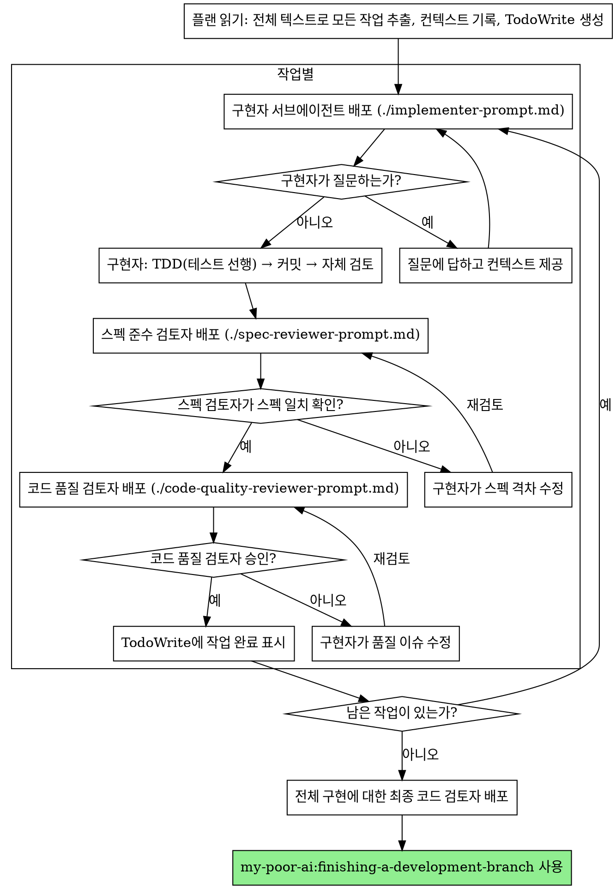

# 서브에이전트 주도 개발

작업별로 새로운 서브에이전트를 배포하여 플랜을 실행하고, 각 작업 후 2단계 검토를 수행: 먼저 스펙 준수 검토, 그 다음 코드 품질 검토.

**서브에이전트를 사용하는 이유:** 격리된 컨텍스트를 가진 전문 에이전트에게 작업을 위임. 지시사항과 컨텍스트를 정확하게 구성함으로써 집중력을 유지하고 작업에 성공하도록 보장. 서브에이전트는 현재 세션의 컨텍스트나 이력을 물려받아서는 안 됨 — 필요한 것을 정확히 구성해서 제공. 이를 통해 조율 작업을 위한 자신의 컨텍스트도 보존됨.

**핵심 원칙:** 작업별 새 서브에이전트 + 2단계 검토 (스펙 후 품질) = 고품질, 빠른 반복

**연속 실행:** 작업 사이에 사용자에게 확인하기 위해 멈추지 말 것. 멈춤 없이 플랜의 모든 작업을 실행. 멈추는 이유는: 해결할 수 없는 BLOCKED 상태, 진행을 실질적으로 막는 모호함, 또는 모든 작업 완료뿐. "계속할까요?" 확인이나 진행 요약은 사용자의 시간을 낭비 — 플랜 실행을 요청받았으면 실행할 것.

## 사용 시점



**vs. Executing Plans (병렬 세션):**

- 동일 세션 (컨텍스트 전환 없음)
- 작업별 새 서브에이전트 (컨텍스트 오염 없음)
- 각 작업 후 2단계 검토: 먼저 스펙 준수, 그 다음 코드 품질
- 빠른 반복 (작업 사이에 사용자 개입 없음)

## 프로세스



## HANDOFF.md 갱신 (spec/phase 완료 시)

복잡 경로 실행 시, 컨트롤러는 `_workspaces/{branch-slug}/HANDOFF.md`를 유지함. 이는 컨텍스트가 끊겨도 다음 세션이 이어받기 위한 **세션 인계 전용** 문서로, 체크박스(기계적 상태)를 보완하는 맥락 내러티브임.

**갱신 시점:**

- **작업(task) 완료** → TodoWrite 체크만. HANDOFF를 건드리지 않음 (과잉 갱신 금지).
- **spec의 한 phase 완료**(스펙에 Phase 그룹이 있을 때) → HANDOFF 본문 갱신 + 인계 로그 1줄.
- **spec 1개 완료**(모든 작업 + 검토 통과) → HANDOFF 본문 갱신 + 인계 로그 1줄. 해당 spec 마일스톤이 커밋될 때 `HANDOFF.md`를 함께 커밋.

**규칙:**

- HANDOFF.md가 없으면 첫 갱신 시 표준 템플릿으로 **먼저 생성**. 별도 초기 생성 단계 없음.
- 본문은 최신 상태로 **덮어쓰기**, 인계 로그는 **최근 5개만** 유지 (6개째면 가장 오래된 줄 삭제).
- 단순·디버깅 경로에는 만들지 않음 (복잡 경로 전용).

템플릿은 my-poor-ai:writing-plans의 "HANDOFF.md — 세션 인계 안내" 참조.

## 모델 선택

비용 절감과 속도 향상을 위해 각 역할에 맞는 가장 덜 강력한 모델 사용.

**기계적 구현 작업** (격리된 함수, 명확한 스펙, 1~2개 파일): 빠르고 저렴한 모델 사용. 플랜이 잘 명세되어 있으면 대부분의 구현 작업은 기계적.

**통합 및 판단 작업** (다중 파일 조율, 패턴 매칭, 디버깅): 표준 모델 사용.

**아키텍처, 설계, 검토 작업**: 가장 유능한 모델 사용.

**작업 복잡도 신호:**

- 완전한 스펙으로 1~2개 파일 수정 → 저렴한 모델
- 통합 관련 여러 파일 수정 → 표준 모델
- 설계 판단 또는 광범위한 코드베이스 이해 필요 → 가장 유능한 모델

## 구현자 상태 처리

구현자 서브에이전트는 네 가지 상태 중 하나를 보고. 각각 적절히 처리:

**DONE:** 스펙 준수 검토로 진행.

**DONE_WITH_CONCERNS:** 구현자가 작업을 완료했지만 의구심을 표시. 진행 전 우려 사항을 읽을 것. 우려가 정확성이나 범위에 관한 것이면 검토 전에 해결. 관찰 사항(예: "이 파일이 커지고 있음")이면 메모하고 검토로 진행.

**NEEDS_CONTEXT:** 구현자가 제공되지 않은 정보를 필요로 함. 누락된 컨텍스트를 제공하고 재배포.

**BLOCKED:** 구현자가 작업을 완료할 수 없음. 차단 요인 평가:

1. 컨텍스트 문제라면, 더 많은 컨텍스트를 제공하고 동일 모델로 재배포
2. 작업에 더 많은 추론이 필요하면, 더 유능한 모델로 재배포
3. 작업이 너무 크면, 더 작은 조각으로 분리
4. 플랜 자체가 잘못된 경우, 사용자에게 에스컬레이션

변경 없이 동일 모델로 재시도를 강제하거나 에스컬레이션을 무시하지 말 것. 구현자가 막혔다고 했으면, 무언가를 바꿔야 함.

## 프롬프트 템플릿

- `./implementer-prompt.md` - 구현자 서브에이전트 배포
- `./spec-reviewer-prompt.md` - 스펙 준수 검토자 서브에이전트 배포
- `./code-quality-reviewer-prompt.md` - 코드 품질 검토자 서브에이전트 배포

## 예시 워크플로우

```
You: Subagent-Driven Development를 사용하여 이 플랜을 실행합니다.

[플랜 파일을 한 번 읽음: _workspaces/{branch-slug}/specs/feature-plan.md]
[전체 텍스트와 컨텍스트로 5개 작업 모두 추출]
[모든 작업으로 TodoWrite 생성]

작업 1: Hook 설치 스크립트

[작업 1 텍스트와 컨텍스트 가져오기 (이미 추출됨)]
[전체 작업 텍스트 + 컨텍스트와 함께 구현 서브에이전트 배포]

구현자: "시작 전에 — hook은 사용자 수준과 시스템 수준 중 어디에 설치해야 하나요?"

You: "사용자 수준 (~/.config/my-poor-ai/hooks/)"

구현자: "알겠습니다. 지금 구현합니다..."
[나중에] 구현자:
  - install-hook 명령 구현 완료
  - 테스트 추가, 5/5 통과
  - 자체 검토: --force 플래그 누락 발견, 추가 완료
  - 커밋 완료

[스펙 준수 검토자 배포]
스펙 검토자: ✅ 스펙 준수 — 모든 요구사항 충족, 추가 항목 없음

[git SHA 가져오기, 코드 품질 검토자 배포]
코드 검토자: 장점: 좋은 테스트 커버리지, 깔끔함. 이슈: 없음. 승인.

[작업 1 완료 표시]

작업 2: 복구 모드

[작업 2 텍스트와 컨텍스트 가져오기 (이미 추출됨)]
[전체 작업 텍스트 + 컨텍스트와 함께 구현 서브에이전트 배포]

구현자: [질문 없이 진행]
구현자:
  - verify/repair 모드 추가
  - 8/8 테스트 통과
  - 자체 검토: 이상 없음
  - 커밋 완료

[스펙 준수 검토자 배포]
스펙 검토자: ❌ 이슈:
  - 누락: 진행 보고 (스펙에 "100개 항목마다 보고" 명시)
  - 추가: --json 플래그 추가됨 (요청되지 않음)

[구현자가 이슈 수정]
구현자: --json 플래그 제거, 진행 보고 추가 완료

[스펙 검토자 재검토]
스펙 검토자: ✅ 이제 스펙 준수

[코드 품질 검토자 배포]
코드 검토자: 장점: 탄탄함. 이슈 (중요): 매직 넘버 (100)

[구현자가 수정]
구현자: PROGRESS_INTERVAL 상수로 추출 완료

[코드 검토자 재검토]
코드 검토자: ✅ 승인

[작업 2 완료 표시]

...

[모든 작업 완료 후]
[최종 코드 검토자 배포]
최종 검토자: 모든 요구사항 충족, 머지 준비 완료

완료!
```

## 장점

**수동 실행 대비:**

- 서브에이전트가 자연스럽게 TDD 준수
- 작업별 새로운 컨텍스트 (혼란 없음)
- 병렬 안전 (서브에이전트 간 간섭 없음)
- 서브에이전트가 질문 가능 (작업 전과 중 모두)

**Executing Plans 대비:**

- 동일 세션 (핸드오프 없음)
- 지속적 진행 (대기 없음)
- 검토 체크포인트 자동화

**효율성 향상:**

- 파일 읽기 오버헤드 없음 (컨트롤러가 전체 텍스트 제공)
- 컨트롤러가 필요한 컨텍스트를 정확히 선별
- 서브에이전트가 사전에 완전한 정보 수령
- 작업 시작 전에 질문 노출 (완료 후가 아님)

**품질 게이트:**

- 자체 검토로 핸드오프 전 이슈 포착
- 2단계 검토: 스펙 준수 후 코드 품질
- 검토 루프로 수정 실제 동작 보장
- 스펙 준수로 과잉/과소 구현 방지
- 코드 품질로 구현이 잘 만들어짐 보장

**비용:**

- 더 많은 서브에이전트 호출 (작업당 구현자 + 검토자 2명)
- 컨트롤러가 더 많은 준비 작업 수행 (모든 작업 사전 추출)
- 검토 루프로 반복 추가
- 하지만 조기에 이슈 포착 (나중에 디버깅하는 것보다 저렴)

## 위험 신호

**절대 금지:**

- 명시적 사용자 동의 없이 main/master 브랜치에서 구현 시작
- 검토 생략 (스펙 준수 또는 코드 품질 모두)
- 수정되지 않은 이슈로 진행
- 여러 구현 서브에이전트를 병렬로 배포 (충돌 발생)
- 서브에이전트에게 플랜 파일 읽게 하기 (전체 텍스트를 직접 제공할 것)
- 장면 설정 컨텍스트 생략 (서브에이전트가 작업의 위치를 이해해야 함)
- 서브에이전트 질문 무시 (진행 전 먼저 답변)
- 스펙 준수에서 "거의 충족"으로 수용 (스펙 검토자가 이슈 발견 = 미완료)
- 검토 루프 생략 (검토자가 이슈 발견 = 구현자가 수정 = 재검토)
- 구현자 자체 검토가 실제 검토를 대체하게 하기 (둘 다 필요)
- **스펙 준수 ✅ 전에 코드 품질 검토 시작** (순서 잘못됨)
- 어느 검토에서든 미해결 이슈가 있는 채로 다음 작업으로 이동
- spec/phase 완료 후 HANDOFF.md 갱신 누락 (인계 맥락 유실)
- 작업(task) 완료마다 HANDOFF.md 갱신 (불필요한 과잉 — 체크박스가 task를 추적)

**서브에이전트가 질문하는 경우:**

- 명확하고 완전하게 답변
- 필요시 추가 컨텍스트 제공
- 구현으로 서두르지 말 것

**검토자가 이슈를 발견한 경우:**

- 구현자(동일 서브에이전트)가 수정
- 검토자가 재검토
- 승인될 때까지 반복
- 재검토 생략 금지

**서브에이전트가 작업에 실패한 경우:**

- 구체적인 지시사항으로 수정 서브에이전트 배포
- 수동으로 수정 시도 금지 (컨텍스트 오염)

## 통합

**필수 워크플로우 skill:**

- **my-poor-ai:using-git-worktrees** — 격리된 작업 공간 보장 (생성 또는 기존 것 검증)
- **my-poor-ai:writing-plans** — 이 skill이 실행할 플랜 생성
- **my-poor-ai:requesting-code-review** — 검토자 서브에이전트용 코드 검토 템플릿
- **my-poor-ai:finishing-a-development-branch** — 모든 작업 완료 후 개발 마무리

**서브에이전트가 사용해야 할 것:**

- **my-poor-ai:test-driven-development** — 서브에이전트가 각 작업에 TDD 적용

**대안 워크플로우:**

- **my-poor-ai:executing-plans** — 동일 세션 실행 대신 병렬 세션에 사용
