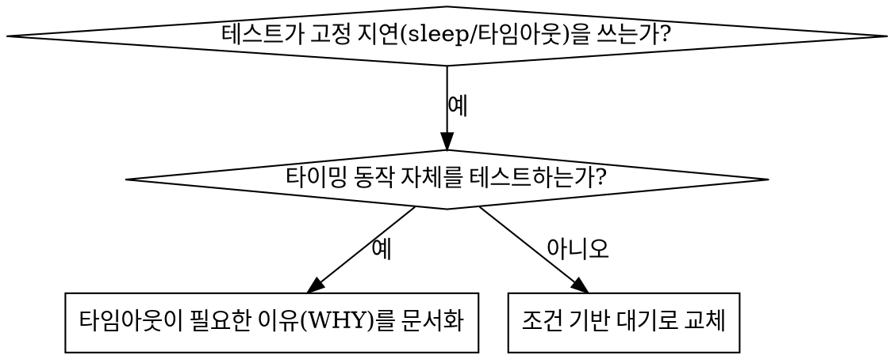

# 조건 기반 대기

## 개요

불안정한(flaky) 테스트는 임의의 지연으로 타이밍을 추측하는 경우가 많음. 이는 경쟁 조건(race condition)을 만들어, 빠른 머신에서는 통과하지만 부하가 걸리거나 CI에서는 실패하게 만듦.

**핵심 원칙:** 얼마나 걸릴지 추측하지 말고, 실제로 기다려야 하는 조건이 충족될 때까지 기다릴 것.

## 사용 시점



**사용할 때:**

- 테스트에 임의의 지연이 있을 때 (고정 sleep, 고정 타임아웃)
- 테스트가 불안정할 때 (가끔 통과, 부하 시 실패)
- 병렬 실행 시 테스트가 타임아웃될 때
- 비동기 작업의 완료를 기다릴 때

**사용하지 않을 때:**

- 타이밍 동작 자체를 테스트할 때 (디바운스, 스로틀 간격 등)
- 임의의 타임아웃을 쓴다면 그 이유(WHY)를 항상 문서화할 것

## 핵심 패턴

```
// ❌ 변경 전: 타이밍을 추측
지연(50ms 동안 대기)        // 50ms면 충분하길 바라며 추측
result = 결과_조회()
검증: result 가 정의됨

// ✅ 변경 후: 조건을 기다림
대기(조건: () => 결과_조회() != 미정의)
result = 결과_조회()
검증: result 가 정의됨
```

## 빠른 패턴

| 시나리오    | 패턴                                              |
| ----------- | ------------------------------------------------- |
| 이벤트 대기 | `대기(() => events 중 타입이 'DONE'인 항목 존재)` |
| 상태 대기   | `대기(() => machine.state == 'ready')`            |
| 개수 대기   | `대기(() => items.length >= 5)`                   |
| 파일 대기   | `대기(() => 파일이_존재함(path))`                 |
| 복합 조건   | `대기(() => obj.ready && obj.value > 10)`         |

## 구현

범용 폴링 함수 (언어 중립 의사코드):

```
함수 대기(조건, 설명, 타임아웃ms = 5000):
    시작시각 = 현재시각()

    무한 반복:
        result = 조건()
        만약 result 가 참이면:
            return result

        만약 현재시각() - 시작시각 > 타임아웃ms 이면:
            예외 발생("'{설명}' 대기 타임아웃: {타임아웃ms}ms 경과")

        지연(10ms 동안 대기)   // 10ms마다 폴링
```

이 디렉토리의 `condition-based-waiting-example.ts`에 도메인 특화 헬퍼(`waitForEvent`, `waitForEventCount`, `waitForEventMatch`)를 포함한 완전한 구현 예시가 있음 — 실제 디버깅 세션에서 도출된 코드. 구체적인 실행 방식(테스트 러너 등)은 `stack-profile.json`의 `testFramework`가 결정함.

## 흔한 실수

**❌ 너무 빠른 폴링:** 1ms마다 검사 — CPU 낭비
**✅ 해결:** 10ms 간격으로 폴링

**❌ 타임아웃 없음:** 조건이 영영 충족되지 않으면 무한 루프
**✅ 해결:** 항상 명확한 에러 메시지와 함께 타임아웃 설정

**❌ 오래된 데이터:** 루프 진입 전에 상태를 캐싱
**✅ 해결:** 루프 안에서 매번 getter를 호출해 최신 데이터 확보

## 임의의 타임아웃이 옳은 경우

```
// 도구가 100ms마다 틱(tick)을 발생시킴 — 부분 출력 검증에 2틱 필요
대기이벤트(manager, 'TOOL_STARTED')   // 먼저: 조건을 기다림
지연(200ms 동안 대기)                  // 그다음: 타이밍 동작을 기다림
// 200ms = 100ms 간격의 2틱 — 문서화되고 근거가 있는 대기
```

**요건:**

1. 먼저 트리거가 되는 조건을 기다릴 것
2. 추측이 아니라 알려진 타이밍에 근거할 것
3. 그 이유(WHY)를 주석으로 설명할 것

## 실제 효과

디버깅 세션 사례:

- 3개 파일에 걸친 15개의 불안정한 테스트 수정
- 통과율: 60% → 100%
- 실행 시간: 40% 단축
- 경쟁 조건 제거
