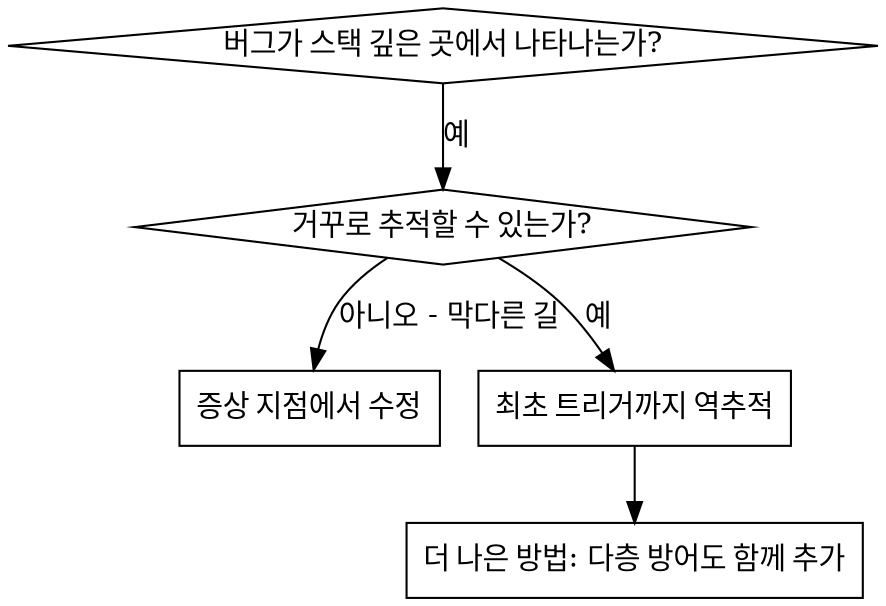
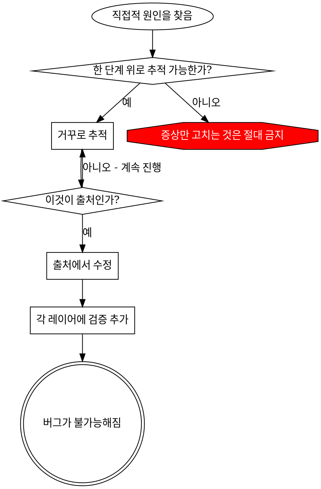

# 근본 원인 역추적

## 개요

버그는 콜 스택 깊은 곳에서 드러나는 경우가 많음 (엉뚱한 디렉토리에서의 git init, 잘못된 위치에 생성된 파일, 잘못된 경로로 열린 데이터베이스 등). 에러가 나타난 자리에서 고치고 싶은 게 본능이지만, 그것은 증상을 다루는 것일 뿐.

**핵심 원칙:** 콜 체인을 거꾸로 거슬러 올라가 최초의 트리거를 찾고, 그 출처에서 고칠 것.

## 사용 시점



**사용할 때:**

- 에러가 진입점이 아니라 실행 깊은 곳에서 발생할 때
- 스택 트레이스가 긴 콜 체인을 보여줄 때
- 잘못된 데이터가 어디서 비롯됐는지 불분명할 때
- 어떤 테스트/코드가 문제를 유발하는지 찾아야 할 때

## 추적 과정

### 1. 증상 관찰

```
에러: ~/project/packages/core 에서 git init 실패
```

### 2. 직접적 원인 찾기

**어떤 코드가 직접 이것을 일으키는가?**

```
git init 을 projectDir 를 작업 디렉토리(cwd)로 삼아 실행
```

### 3. 질문: 무엇이 이것을 호출했는가?

```
WorktreeManager.createSessionWorktree(projectDir, sessionId)
  → Session.initializeWorkspace() 가 호출
  → Session.create() 가 호출
  → 테스트의 Project.create() 가 호출
```

### 4. 계속 위로 추적

**어떤 값이 전달됐는가?**

- `projectDir = ''` (빈 문자열!)
- 빈 문자열을 작업 디렉토리(cwd)로 쓰면 현재 작업 디렉토리로 해석됨
- 그게 바로 소스 코드 디렉토리!

### 5. 최초 트리거 찾기

**빈 문자열은 어디서 왔는가?**

```
context = setupCoreTest()        // { tempDir: '' } 를 반환
Project.create('name', context.tempDir)   // beforeEach 실행 전에 접근됨!
```

## 스택 트레이스 추가하기

수동으로 추적할 수 없을 때는 계측을 추가:

```
// 문제가 되는 작업 직전에
함수 git_초기화(directory):
    stack = 현재_콜스택_캡처()
    표준에러_출력("DEBUG git init:", {
        directory,
        cwd: 현재_작업_디렉토리(),
        env: 현재_환경,
        stack,
    })

    git init 을 directory 를 작업 디렉토리로 삼아 실행
```

**중요:** 테스트에서는 일반 로거 대신 표준 에러 출력을 쓸 것 — 로거 출력은 표시되지 않을 수 있음

**실행하고 캡처:** 테스트를 실행하면서 출력에서 'DEBUG git init' 라인만 걸러내 확인. 테스트 실행 방식은 `stack-profile.json`의 `testFramework`가 결정함.

**스택 트레이스 분석:**

- 테스트 파일 이름을 찾을 것
- 호출을 유발한 줄 번호를 찾을 것
- 패턴을 식별할 것 (같은 테스트인가? 같은 매개변수인가?)

## 어느 테스트가 오염을 일으키는지 찾기

테스트 도중 무언가가 나타나는데 어느 테스트인지 모를 때:

이 디렉토리의 이분 탐색 스크립트 `find-polluter.sh`를 사용:

```
./find-polluter.sh '.git' 'src/**/*.test.ts'
```

테스트를 하나씩 실행하다가 첫 오염 지점에서 멈춤. 사용법은 스크립트 참조.

## 실제 예시: 빈 projectDir

**증상:** 소스 코드 디렉토리인 `packages/core/`에 `.git`이 생성됨

**추적 체인:**

1. `git init`이 현재 작업 디렉토리에서 실행됨 ← 빈 cwd 매개변수
2. WorktreeManager가 빈 projectDir로 호출됨
3. Session.create()가 빈 문자열을 전달함
4. 테스트가 beforeEach 전에 `context.tempDir`에 접근함
5. setupCoreTest()가 초기에 `{ tempDir: '' }`를 반환함

**근본 원인:** 최상위 변수 초기화가 빈 값에 접근한 것

**수정:** tempDir를 beforeEach 전에 접근하면 예외를 던지는 getter로 변경

**다층 방어도 함께 추가:**

- 레이어 1: Project.create()가 디렉토리를 검증
- 레이어 2: WorkspaceManager가 비지 않았는지 검증
- 레이어 3: 환경 가드가 임시 디렉토리 밖 git init을 거부
- 레이어 4: git init 직전에 콜스택 로깅

## 핵심 원칙



**에러가 나타난 자리만 고치는 것은 절대 금지.** 거슬러 올라가 최초 트리거를 찾을 것.

## 스택 트레이스 요령

**테스트에서:** 일반 로거 대신 표준 에러 출력을 쓸 것 — 로거는 억제될 수 있음
**작업 전에:** 실패한 후가 아니라 위험한 작업 직전에 로깅할 것
**맥락을 포함:** 디렉토리, cwd, 환경 변수, 타임스탬프
**스택 캡처:** 콜스택 캡처로 전체 콜 체인을 확보

## 실제 효과

디버깅 세션 사례:

- 5단계 역추적으로 근본 원인 발견
- 출처에서 수정 (getter 검증)
- 4개 레이어의 방어 추가
- 전체 테스트 통과, 오염 제로
