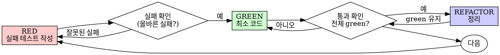

# 테스트 주도 개발 (TDD)

> 이 문서는 스택을 가리지 않음. 테스트 실행 명령·프레임워크·파일 명명은 `stack-profile.json`의 `testFramework`가 정함. 아래 코드는 모두 **언어 중립 의사코드**임.

## 개요

테스트를 먼저 작성함. 실패하는 것을 직접 확인함. 통과시킬 최소한의 코드만 작성함.

**핵심 원칙:** 테스트가 실패하는 것을 직접 보지 않으면, 그 테스트가 옳은 것을 검증하는지 알 수 없음.

**규칙의 문자를 어기는 것은 규칙의 정신을 어기는 것임.**

## 사용 시점

**항상:**

- 새 기능
- 버그 수정
- 리팩터링
- 동작 변경

**예외 (동료 확인 후):**

- 버릴 프로토타입
- 자동 생성 코드
- 설정 파일

"이번 한 번만 TDD를 건너뛰자"는 생각이 드는가? 멈춤. 그것이 합리화임.

## 철칙

```
실패하는 테스트 없이 프로덕션 코드를 작성하지 않음
```

테스트보다 코드를 먼저 썼는가? 삭제함. 처음부터 다시 시작함.

**예외 없음:**

- "참고용"으로 남기지 않음
- 테스트를 작성하면서 코드에 "맞춰가지" 않음
- 참조하지 않음
- 삭제는 삭제를 뜻함

테스트로부터 새로 구현함.

## RED-GREEN-REFACTOR



### RED — 실패하는 테스트 작성

무엇이 일어나야 하는지 보여주는 최소 테스트 하나를 작성함.

```
# ✅ 좋음: 명확한 이름, 실제 동작 검증, 단일 책임
test "실패한 작업을 3번 재시도한다":
    시도 = 0
    작업 = 함수():
        시도 += 1
        if 시도 < 3: 에러 발생
        return "성공"

    결과 = retry(작업)

    assert 결과 == "성공"
    assert 시도 == 3
```

```
# ❌ 나쁨: 모호한 이름, 코드가 아니라 모킹을 검증
test "재시도 동작":
    모킹 = 두 번 실패 후 "성공" 반환하도록 설정
    retry(모킹)
    assert 모킹이 3번 호출됨
```

**요건:**

- 단일 동작
- 명확한 이름
- 실제 코드 (불가피할 때만 모킹)

### RED 검증 — 실패를 직접 확인

**필수. 절대 건너뛰지 않음.**

```
# 해당 테스트만 실행 (실제 명령은 testFramework 기준)
실행: <테스트 파일 하나를 지정해 실행>
```

확인할 것:

- 테스트가 실패함 (오류가 아니라 실패)
- 실패 메시지가 예상한 것임
- 기능이 없어서 실패함 (오타 때문이 아니라)

**테스트가 통과하는가?** 이미 있는 동작을 테스트하는 것임. 테스트를 고침.

**테스트가 오류를 내는가?** 오류를 고치고, 올바르게 실패할 때까지 다시 실행함.

### GREEN — 최소한의 코드

테스트를 통과시킬 가장 단순한 코드를 작성함.

```
# ✅ 좋음: 통과에 필요한 최소한
function retry(fn):
    반복 i in 0..2:
        try: return fn()
        catch e: if i == 2: 에러 다시 발생
```

```
# ❌ 나쁨: 과도한 설계 (YAGNI)
function retry(fn, 옵션 = { 최대횟수, 백오프, onRetry }):
    # 요청하지 않은 일반화
```

기능을 더 넣거나, 다른 코드를 리팩터링하거나, 테스트 범위를 넘어 "개선"하지 않음.

### GREEN 검증 — 통과를 직접 확인

**필수.**

```
실행: <해당 테스트 실행>
```

확인할 것:

- 테스트가 통과함
- 다른 테스트들도 여전히 통과함
- 출력이 깨끗함 (오류·경고 없음)

**테스트가 실패하는가?** 테스트가 아니라 코드를 고침.

**다른 테스트가 실패하는가?** 지금 고침.

### REFACTOR — 정리

GREEN 이후에만:

- 중복 제거
- 이름 개선
- 헬퍼 추출

테스트를 green으로 유지함. 동작을 추가하지 않음.

### 반복

다음 기능을 위한 다음 실패 테스트로.

## 좋은 테스트

| 품질          | 좋은 예                                       | 나쁜 예                             |
| ------------- | --------------------------------------------- | ----------------------------------- |
| **최소화**    | 한 가지만. 이름에 "그리고"가 있으면 분리함. | "이메일과 도메인과 공백을 검증한다" |
| **명확성**    | 이름이 동작을 설명함                        | "test1"                             |
| **의도 표현** | 원하는 API를 보여줌                         | 코드가 무엇을 해야 하는지 불명확    |

## 순서가 중요한 이유

**"코드를 먼저 쓰고 나중에 테스트로 검증하면 된다"**

코드 다음에 쓴 테스트는 즉시 통과함. 즉시 통과하는 것은 아무것도 증명하지 못함:

- 잘못된 것을 테스트할 수 있음
- 동작이 아니라 구현을 테스트할 수 있음
- 빠뜨린 엣지 케이스를 놓침
- 버그를 잡는 모습을 한 번도 못 봄

테스트를 먼저 쓰면 실패를 직접 보게 되고, 그 테스트가 실제로 무언가를 검증한다는 것이 증명됨.

**"엣지 케이스는 이미 수동으로 다 해봤다"**

수동 테스트는 임시방편임. 다 해봤다고 생각하지만:

- 무엇을 테스트했는지 기록이 없음
- 코드가 바뀔 때 다시 돌릴 수 없음
- 압박 속에서 케이스를 잊기 쉬움
- "해봤을 때 됐다" ≠ 포괄적

자동화된 테스트는 체계적임. 매번 같은 방식으로 돌아감.

**"여러 시간 작업한 걸 삭제하는 건 낭비다"**

매몰 비용 오류임. 그 시간은 이미 지났음. 지금 선택지는:

- 삭제하고 TDD로 다시 씀 (시간 더 들지만 신뢰도 높음)
- 남기고 나중에 테스트를 붙임 (빠르지만 신뢰도 낮고 버그 가능성)

"낭비"는 신뢰할 수 없는 코드를 남기는 것임. 진짜 테스트 없이 도는 코드는 기술 부채임.

**"TDD는 교조적이고, 실용적이라는 건 상황에 맞추는 것이다"**

TDD가 곧 실용임:

- 커밋 전에 버그를 잡음 (나중 디버깅보다 빠름)
- 회귀를 막음 (테스트가 깨짐을 즉시 잡음)
- 동작을 문서화함 (테스트가 사용법을 보여줌)
- 리팩터링을 가능하게 함 (자유롭게 바꿔도 테스트가 깨짐을 잡음)

"실용적인" 지름길 = 프로덕션에서 디버깅 = 결국 더 느림.

**"나중에 테스트해도 목표는 같다 — 형식이 아니라 정신이 중요하다"**

아님. 나중에 쓴 테스트는 "이게 무엇을 하는가?"에 답함. 먼저 쓴 테스트는 "이게 무엇을 해야 하는가?"에 답함.

나중에 쓴 테스트는 구현에 편향됨. 필요한 것이 아니라 만든 것을 검증함. 먼저 쓴 테스트는 구현 전에 엣지 케이스를 발견하게 강제함.

## 흔한 합리화

| 변명                                 | 현실                                                                  |
| ------------------------------------ | --------------------------------------------------------------------- |
| "테스트하기엔 너무 간단하다"         | 간단한 코드도 깨짐. 테스트 작성에 30초.                             |
| "나중에 테스트하겠다"                | 즉시 통과하는 테스트는 아무것도 증명하지 못함.                      |
| "나중에 해도 목표는 같다"            | 후행 = "무엇을 하는가?" / 선행 = "무엇을 해야 하는가?"                |
| "이미 수동으로 해봤다"               | 임시방편 ≠ 체계적. 기록 없음, 재실행 불가.                            |
| "여러 시간 작업을 삭제는 낭비"       | 매몰 비용 오류. 검증 안 된 코드 유지가 기술 부채.                     |
| "참고용으로 두고 테스트 먼저 쓰겠다" | 결국 거기에 맞춰가게 됨. 그게 후행임. 삭제는 삭제임.              |
| "먼저 탐색이 필요하다"               | 괜찮음. 탐색 코드는 버리고 TDD로 시작함.                            |
| "테스트하기 어렵다 = 설계가 불명확"  | 테스트의 신호를 들음. 테스트하기 어렵다 = 쓰기 어려움.              |
| "TDD가 나를 느리게 한다"             | TDD가 디버깅보다 빠름. 실용 = 선행.                                 |
| "수동이 더 빠르다"                   | 수동으로는 엣지 케이스가 증명되지 않음. 매 변경마다 다시 해야 함. |
| "기존 코드엔 테스트가 없다"          | 지금 개선하는 중임. 손대는 코드에 테스트를 붙임.                  |

## 위험 신호 — 멈추고 처음부터

- 테스트보다 코드를 먼저 작성
- 구현 후 테스트
- 테스트가 즉시 통과
- 테스트가 왜 실패했는지 설명 못 함
- "나중에" 붙인 테스트
- "이번 한 번만" 합리화
- "이미 수동으로 해봤다"
- "나중에 해도 목표는 같다"
- "형식이 아니라 정신이 중요하다"
- "참고용으로 둔다" 또는 "기존 코드에 맞춘다"
- "이미 시간을 썼으니 삭제는 낭비다"
- "TDD는 교조적, 나는 실용적이다"
- "이건 달라, 왜냐하면…"

**이 모두는 한 가지를 뜻함: 코드를 삭제하고 TDD로 처음부터 시작할 것.**

## 예시: 버그 수정

**버그:** 빈 이메일이 통과됨.

**RED**

```
test "빈 이메일을 거부한다":
    결과 = submitForm({ email: "" })
    assert 결과.error == "이메일 필수"
```

**RED 검증**

```
실행: <해당 테스트 실행>
예상: FAIL — "이메일 필수"를 기대했으나 없음
```

**GREEN**

```
function submitForm(data):
    if data.email 가 비어있음:
        return { error: "이메일 필수" }
    # ...
```

**GREEN 검증**

```
실행: <해당 테스트 실행>
예상: PASS
```

**REFACTOR**
필요하면 여러 필드 유효성 검사를 헬퍼로 추출함.

## 검증 체크리스트

작업 완료 전:

- [ ] 모든 새 함수/메서드에 테스트가 있음
- [ ] 구현 전에 각 테스트가 실패하는 것을 확인했음
- [ ] 각 테스트가 예상한 이유로 실패했음 (기능 없음, 오타 아님)
- [ ] 각 테스트를 통과시킬 최소 코드만 작성했음
- [ ] 모든 테스트가 통과함
- [ ] 출력이 깨끗함 (오류·경고 없음)
- [ ] 테스트가 실제 코드를 씀 (불가피할 때만 모킹)
- [ ] 엣지 케이스와 오류가 다뤄졌음

전부 체크할 수 없는가? TDD를 건너뛴 것임. 처음부터 시작함.

## 막혔을 때

| 문제                 | 해결                                                   |
| -------------------- | ------------------------------------------------------ |
| 테스트 방법을 모름   | 원하는 API를 적음. 단언부터 적음. 동료에게 물음. |
| 테스트가 너무 복잡함 | 설계가 너무 복잡한 것. 인터페이스를 단순화함.        |
| 전부 모킹해야 함     | 결합이 너무 강한 것. 의존성 주입을 씀.               |
| 테스트 설정이 방대함 | 헬퍼를 추출함. 그래도 복잡하면 설계를 단순화함.    |

## 디버깅 통합

버그를 찾았는가? 재현하는 실패 테스트를 작성함. TDD 사이클을 따름. 테스트가 수정을 증명하고 회귀를 막음.

테스트 없이 버그를 고치지 않음.

## 테스트 안티패턴

모킹이나 테스트 유틸리티를 추가할 때, 흔한 함정을 피하려면 `testing-anti-patterns.md`를 읽음:

- 실제 동작 대신 모킹의 동작을 테스트
- 프로덕션 클래스에 테스트 전용 메서드 추가
- 의존성을 이해하지 않고 모킹

## 파이프라인에서 실행될 때

TDD가 단독 대화가 아니라 my-poor-ai spec-driven 파이프라인(spec → 구현)의 구현 단계로 실행될 때의 입력·실행·순서 계약은 `harness-integration.md`를 읽음.

## 최종 규칙

```
프로덕션 코드 → 테스트가 존재하고, 먼저 실패했음
그렇지 않으면 → TDD가 아님
```

동료의 허가 없이는 예외가 없음.
