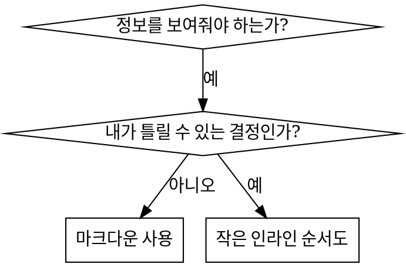

# 스킬 작성

## 개요

**스킬 작성은 프로세스 문서에 적용된 TDD임.**

**개인 스킬은 에이전트별 디렉토리에 위치 (Claude Code의 경우 `~/.claude/skills`, Codex의 경우 `~/.agents/skills/`)**

테스트 케이스(subagent를 활용한 압박 시나리오)를 작성하고, 실패를 관찰하고(기준 동작), 스킬(문서)을 작성하고, 테스트 통과를 관찰하고(에이전트 준수), 리팩터링(허점 제거)함.

**핵심 원칙:** 스킬 없이 에이전트가 실패하는 것을 직접 보지 않았다면, 스킬이 올바른 것을 가르치는지 알 수 없음.

**필수 배경:** 이 스킬을 사용하기 전에 my-poor-ai:test-driven-development를 반드시 이해해야 함. 해당 스킬이 근본적인 RED-GREEN-REFACTOR 사이클을 정의함. 이 스킬은 TDD를 문서에 적용.

**공식 가이드:** Anthropic의 공식 스킬 작성 모범 사례는 anthropic-best-practices.md를 참조. 이 문서는 이 스킬의 TDD 중심 접근 방식을 보완하는 추가 패턴과 가이드라인을 제공.

## 스킬이란?

**스킬**은 검증된 기법, 패턴, 도구에 대한 참조 가이드. 스킬은 미래의 Claude 인스턴스가 효과적인 접근 방식을 찾고 적용하는 데 도움을 줌.

**스킬은:** 재사용 가능한 기법, 패턴, 도구, 참조 가이드

**스킬은 아님:** 한 번 문제를 해결한 방법에 대한 서술

## 스킬을 위한 TDD 매핑

| TDD 개념                | 스킬 생성                                    |
| ----------------------- | -------------------------------------------- |
| **테스트 케이스**       | subagent를 활용한 압박 시나리오              |
| **프로덕션 코드**       | 스킬 문서 (SKILL.md)                         |
| **테스트 실패 (RED)**   | 스킬 없이 에이전트가 규칙 위반 (기준)        |
| **테스트 통과 (GREEN)** | 스킬이 있을 때 에이전트 준수                 |
| **리팩터링**            | 준수를 유지하면서 허점 제거                  |
| **테스트 먼저 작성**    | 스킬 작성 전 기준 시나리오 실행              |
| **실패 관찰**           | 에이전트가 자연스럽게 사용하는 합리화 문서화 |
| **최소 코드**           | 해당 특정 위반을 다루는 스킬 작성            |
| **통과 관찰**           | 에이전트가 이제 준수하는지 확인              |
| **리팩터링 사이클**     | 새로운 합리화 발견 → 보완 → 재검증           |

전체 스킬 생성 프로세스는 RED-GREEN-REFACTOR를 따름.

## 스킬 생성 시점

**생성 시:**

- 직관적으로 명확하지 않았던 기법
- 여러 프로젝트에 걸쳐 다시 참조할 내용
- 패턴이 광범위하게 적용됨 (프로젝트 특화 아님)
- 다른 사람들에게도 도움이 될 내용

**생성 안 함:**

- 일회성 해결책
- 다른 곳에 잘 문서화된 표준 관행
- 프로젝트별 관례 (CLAUDE.md에 포함)
- 기계적 제약 (정규식/검증으로 강제할 수 있다면 자동화할 것 — 문서는 판단이 필요한 경우에 사용)

## 스킬 유형

### 기법

구체적인 방법과 따를 단계 (condition-based-waiting, root-cause-tracing)

### 패턴

문제를 바라보는 방식 (flatten-with-flags, test-invariants)

### 참조

API 문서, 구문 가이드, 도구 문서 (office docs)

## 디렉토리 구조

```
skills/
  skill-name/
    SKILL.md              # 주요 참조 (필수)
    supporting-file.*     # 필요한 경우에만
```

**플랫 네임스페이스** — 검색 가능한 하나의 네임스페이스에 모든 스킬

**별도 파일 사용 시:**

1. **대용량 참조** (100줄 이상) — API 문서, 포괄적인 구문
2. **재사용 가능한 도구** — 스크립트, 유틸리티, 템플릿

**인라인 유지:**

- 원칙과 개념
- 코드 패턴 (50줄 미만)
- 그 외 모든 것

## SKILL.md 구조

**Frontmatter (YAML):**

- 두 가지 필수 필드: `name`과 `description` ([agentskills.io/specification](https://agentskills.io/specification)에서 지원되는 모든 필드 확인)
- 최대 1024자
- `name`: 문자, 숫자, 하이픈만 사용 (괄호, 특수 문자 없음)
- `description`: 3인칭, 언제 사용할지만 설명 (무엇을 하는지 아님)
  - 트리거 조건에 집중하기 위해 "Use when..."으로 시작
  - 구체적인 증상, 상황, 맥락 포함
  - **스킬의 프로세스나 워크플로우 요약 절대 금지** (CSO 섹션 참조)
  - 가능하면 500자 이하 유지

```markdown
---
name: Skill-Name-With-Hyphens
description: Use when [specific triggering conditions and symptoms]
---

# 스킬 이름

## 개요

이것은 무엇인가? 1-2문장으로 핵심 원칙.

## 사용 시점

[결정이 명확하지 않은 경우 간단한 인라인 순서도]

증상과 사용 사례 목록
사용하지 않는 경우

## 핵심 패턴 (기법/패턴의 경우)

이전/이후 코드 비교

## 빠른 참조

일반 작업 스캔을 위한 표 또는 불릿

## 구현

간단한 패턴은 인라인 코드
대용량 참조나 재사용 도구는 파일 링크

## 흔한 실수

무엇이 잘못되는지 + 해결책

## 실제 영향 (선택사항)

구체적인 결과
```

## Claude Search Optimization (CSO)

**발견에 중요:** 미래의 Claude가 스킬을 찾을 수 있어야 함

### 1. 풍부한 Description 필드

**목적:** Claude는 주어진 작업에 어떤 스킬을 불러올지 결정하기 위해 description을 읽음. "지금 이 스킬을 읽어야 하는가?"에 답하도록 만들 것.

**형식:** 트리거 조건에 집중하기 위해 "Use when..."으로 시작

**중요: Description = 사용 시점, 스킬이 하는 일이 아님**

description은 트리거 조건만 설명해야 함. 스킬의 프로세스나 워크플로우를 요약하지 말 것.

**왜 중요한가:** 테스트에서 description이 스킬의 워크플로우를 요약할 때, Claude가 전체 스킬 내용을 읽는 대신 description을 따를 수 있음을 확인. "code review between tasks"라는 description이 스킬의 순서도에서 두 번의 리뷰(스펙 준수 후 코드 품질)를 명확히 보여줌에도 불구하고 Claude가 한 번만 리뷰하게 만듦.

description을 "Use when executing implementation plans with independent tasks" (워크플로우 요약 없음)으로 변경했을 때, Claude가 순서도를 올바르게 읽고 두 단계 리뷰 프로세스를 따름.

**함정:** 워크플로우를 요약하는 description은 Claude가 취할 지름길을 만듦. 스킬 본문이 Claude가 건너뛰는 문서가 됨.

```yaml
# ❌ BAD: Summarizes workflow - Claude may follow this instead of reading skill
description: Use when executing plans - dispatches subagent per task with code review between tasks

# ❌ BAD: Too much process detail
description: Use for TDD - write test first, watch it fail, write minimal code, refactor

# ✅ GOOD: Just triggering conditions, no workflow summary
description: Use when executing implementation plans with independent tasks in the current session

# ✅ GOOD: Triggering conditions only
description: Use when implementing any feature or bugfix, before writing implementation code
```

**내용:**

- 이 스킬이 적용됨을 알리는 구체적인 트리거, 증상, 상황 사용
- _언어별 증상_ (setTimeout, sleep)이 아닌 _문제_ (race condition, 불일치 동작) 설명
- 스킬 자체가 특정 기술에 한정되지 않는 한 트리거는 기술 중립적으로 유지
- 기술 특화 스킬이면 트리거에서 명시적으로 밝힐 것
- 3인칭으로 작성 (시스템 프롬프트에 주입됨)
- **스킬의 프로세스나 워크플로우 절대 요약 금지**

```yaml
# ❌ BAD: Too abstract, vague, doesn't include when to use
description: For async testing

# ❌ BAD: First person
description: I can help you with async tests when they're flaky

# ❌ BAD: Mentions technology but skill isn't specific to it
description: Use when tests use setTimeout/sleep and are flaky

# ✅ GOOD: Starts with "Use when", describes problem, no workflow
description: Use when tests have race conditions, timing dependencies, or pass/fail inconsistently

# ✅ GOOD: Technology-specific skill with explicit trigger
description: Use when using React Router and handling authentication redirects
```

### 2. 키워드 커버리지

Claude가 검색할 단어 사용:

- 에러 메시지: "Hook timed out", "ENOTEMPTY", "race condition"
- 증상: "flaky", "hanging", "zombie", "pollution"
- 동의어: "timeout/hang/freeze", "cleanup/teardown/afterEach"
- 도구: 실제 명령어, 라이브러리 이름, 파일 유형

### 3. 설명적 이름 짓기

**능동태, 동사 시작:**

- ✅ `creating-skills` not `skill-creation`
- ✅ `condition-based-waiting` not `async-test-helpers`

### 4. 토큰 효율성 (중요)

**문제:** getting-started와 자주 참조되는 스킬은 모든 대화에 로드됨. 모든 토큰이 중요.

**목표 단어 수:**

- getting-started 워크플로우: 각 150단어 미만
- 자주 로드되는 스킬: 전체 200단어 미만
- 기타 스킬: 500단어 미만 (여전히 간결하게)

**기법:**

**상세 내용을 도구 도움말로 이동:**

```bash
# ❌ BAD: Document all flags in SKILL.md
search-conversations supports --text, --both, --after DATE, --before DATE, --limit N

# ✅ GOOD: Reference --help
search-conversations supports multiple modes and filters. Run --help for details.
```

**교차 참조 사용:**

```markdown
# ❌ BAD: Repeat workflow details

When searching, dispatch subagent with template...
[20 lines of repeated instructions]

# ✅ GOOD: Reference other skill

Always use subagents (50-100x context savings). REQUIRED: Use [other-skill-name] for workflow.
```

**예시 압축:**

```markdown
# ❌ BAD: Verbose example (42 words)

your human partner: "How did we handle authentication errors in React Router before?"
You: I'll search past conversations for React Router authentication patterns.
[Dispatch subagent with search query: "React Router authentication error handling 401"]

# ✅ GOOD: Minimal example (20 words)

Partner: "How did we handle auth errors in React Router?"
You: Searching...
[Dispatch subagent → synthesis]
```

**중복 제거:**

- 교차 참조된 스킬에 있는 내용 반복 금지
- 명령어에서 명백한 것 설명 금지
- 동일 패턴의 여러 예시 포함 금지

**검증:**

```bash
wc -w skills/path/SKILL.md
# getting-started 워크플로우: 각 150단어 목표
# 기타 자주 로드되는 스킬: 전체 200단어 목표
```

**행동이나 핵심 통찰에 따라 이름 짓기:**

- ✅ `condition-based-waiting` > `async-test-helpers`
- ✅ `using-skills` not `skill-usage`
- ✅ `flatten-with-flags` > `data-structure-refactoring`
- ✅ `root-cause-tracing` > `debugging-techniques`

**동명사(-ing)는 프로세스에 잘 맞음:**

- `creating-skills`, `testing-skills`, `debugging-with-logs`
- 능동적이고, 수행 중인 행동을 설명

### 4. 다른 스킬 교차 참조

**다른 스킬을 참조하는 문서 작성 시:**

스킬 이름만 사용하고, 명시적인 필수 표시 사용:

- ✅ 좋음: `**필수 서브 스킬:** my-poor-ai:test-driven-development 사용`
- ✅ 좋음: `**필수 배경:** my-poor-ai:systematic-debugging을 반드시 이해해야 함`
- ❌ 나쁨: `See skills/testing/test-driven-development` (필수 여부 불명확)
- ❌ 나쁨: `@skills/testing/test-driven-development/SKILL.md` (강제 로드, 컨텍스트 소모)

**@ 링크를 사용하지 않는 이유:** `@` 구문은 필요하기 전에 파일을 즉시 로드하여 200k+ 컨텍스트를 소모.

## 순서도 사용



**순서도 사용 경우:**

- 명확하지 않은 결정 지점
- 너무 일찍 멈출 수 있는 프로세스 루프
- "A vs B 중 언제 사용" 결정

**순서도 사용 금지:**

- 참조 자료 → 표, 목록
- 코드 예시 → 마크다운 블록
- 선형 지시사항 → 번호 목록
- 의미 없는 레이블 (step1, helper2)

## 코드 예시

**많은 평범한 예시보다 하나의 훌륭한 예시가 나음**

가장 관련성 높은 언어 선택:

- 테스트 기법 → TypeScript/JavaScript
- 시스템 디버깅 → Shell/Python
- 데이터 처리 → Python

**좋은 예시:**

- 완전하고 실행 가능
- WHY를 설명하는 주석 포함
- 실제 시나리오에서 가져옴
- 패턴을 명확하게 보여줌
- 적용 가능한 형태 (일반적인 템플릿 아님)

**금지:**

- 5개 이상의 언어로 구현
- 빈칸 채우기 템플릿 생성
- 가상의 예시 작성

하나의 훌륭한 예시면 충분.

## 파일 구성

### 독립형 스킬

```
defense-in-depth/
  SKILL.md    # 모든 내용 인라인
```

사용 시: 모든 내용이 맞고, 대용량 참조가 필요 없을 때

### 재사용 도구가 있는 스킬

```
condition-based-waiting/
  SKILL.md    # 개요 + 패턴
  example.ts  # 적용 가능한 작동 헬퍼
```

사용 시: 도구가 서술이 아닌 재사용 가능한 코드일 때

### 대용량 참조가 있는 스킬

```
pptx/
  SKILL.md       # 개요 + 워크플로우
  pptxgenjs.md   # 600줄 API 참조
  ooxml.md       # 500줄 XML 구조
  scripts/       # 실행 가능한 도구
```

사용 시: 참조 자료가 인라인에 넣기엔 너무 클 때

## 철칙 (TDD와 동일)

```
실패하는 테스트 없이는 스킬도 없다
```

새로운 스킬과 기존 스킬 편집 모두에 적용.

테스트 전에 스킬 작성? 삭제. 처음부터 다시.
테스트 없이 스킬 편집? 동일한 위반.

**예외 없음:**

- "간단한 추가"라도 예외 없음
- "섹션만 추가"라도 예외 없음
- "문서 업데이트"라도 예외 없음
- 테스트되지 않은 변경 사항을 "참조"로 유지 금지
- 테스트 실행 중 "적용" 금지
- 삭제는 삭제를 의미함

**필수 배경:** my-poor-ai:test-driven-development 스킬이 이것이 중요한 이유를 설명함. 동일한 원칙이 문서에도 적용됨.

## 모든 스킬 유형 테스트

스킬 유형에 따라 다른 테스트 접근 방식이 필요:

### 규율 강화 스킬 (규칙/요구사항)

**예시:** TDD, verification-before-completion, designing-before-coding

**테스트 방법:**

- 학문적 질문: 규칙을 이해하는가?
- 압박 시나리오: 압박 하에서도 준수하는가?
- 여러 압박 결합: 시간 + 매몰 비용 + 피로
- 합리화 식별 후 명시적 반론 추가

**성공 기준:** 에이전트가 최대 압박 하에서도 규칙 준수

### 기법 스킬 (방법 가이드)

**예시:** condition-based-waiting, root-cause-tracing, defensive-programming

**테스트 방법:**

- 적용 시나리오: 기법을 올바르게 적용할 수 있는가?
- 변형 시나리오: 엣지 케이스를 처리하는가?
- 정보 누락 테스트: 지시사항에 공백이 있는가?

**성공 기준:** 에이전트가 새로운 시나리오에 기법을 성공적으로 적용

### 패턴 스킬 (멘탈 모델)

**예시:** reducing-complexity, information-hiding 개념

**테스트 방법:**

- 인식 시나리오: 패턴이 적용되는 것을 인식하는가?
- 적용 시나리오: 멘탈 모델을 사용할 수 있는가?
- 반례: 적용하지 않을 때를 아는가?

**성공 기준:** 에이전트가 패턴을 언제/어떻게 적용할지 올바르게 식별

### 참조 스킬 (문서/API)

**예시:** API 문서, 명령어 참조, 라이브러리 가이드

**테스트 방법:**

- 검색 시나리오: 올바른 정보를 찾을 수 있는가?
- 적용 시나리오: 찾은 것을 올바르게 사용할 수 있는가?
- 공백 테스트: 일반적인 사용 사례가 포함되어 있는가?

**성공 기준:** 에이전트가 참조 정보를 찾아 올바르게 적용

## 테스트 건너뛰기에 대한 흔한 합리화

| 변명                         | 현실                                                                      |
| ---------------------------- | ------------------------------------------------------------------------- |
| "내 스킬은 명백히 명확하다"  | 나에게 명확 ≠ 다른 에이전트에게 명확. 테스트할 것.                        |
| "그냥 참조일 뿐이다"         | 참조에도 공백과 불명확한 섹션이 있을 수 있음. 검색을 테스트할 것.         |
| "테스트는 과도하다"          | 테스트되지 않은 스킬에는 문제가 있음. 항상. 15분 테스트가 몇 시간을 아낌. |
| "문제가 생기면 테스트하겠다" | 문제 = 에이전트가 스킬을 사용할 수 없음. 배포 전에 테스트할 것.           |
| "테스트는 너무 번거롭다"     | 테스트는 프로덕션에서 나쁜 스킬을 디버깅하는 것보다 덜 번거로움.          |
| "품질이 좋다고 확신한다"     | 과신은 문제를 보장함. 어쨌든 테스트할 것.                                 |
| "학문적 검토로 충분하다"     | 읽기 ≠ 사용하기. 적용 시나리오를 테스트할 것.                             |
| "테스트할 시간이 없다"       | 테스트되지 않은 스킬을 배포하면 나중에 수정하는 데 더 많은 시간이 소요됨. |

**이 모든 것의 의미: 배포 전 테스트. 예외 없음.**

## 합리화에 대한 스킬 방탄화

규율을 강화하는 스킬(TDD 등)은 합리화에 저항해야 함. 에이전트는 압박 하에서 허점을 찾을 만큼 영리함.

**심리학 노트:** 설득 기법이 작동하는 이유를 이해하면 체계적으로 적용하는 데 도움이 됨. 권위, 헌신, 희소성, 사회적 증거, 통일성 원칙에 관한 연구 기반(Cialdini, 2021; Meincke et al., 2025)은 persuasion-principles.md 참조.

### 모든 허점을 명시적으로 제거

규칙을 명시하는 것만으로는 부족 — 특정 우회책을 금지:

<Bad>
```markdown
Write code before test? Delete it.
```
</Bad>

<Good>
```markdown
Write code before test? Delete it. Start over.

**No exceptions:**

- Don't keep it as "reference"
- Don't "adapt" it while writing tests
- Don't look at it
- Delete means delete

````
</Good>

### "정신 vs 글자" 주장 다루기

초반에 기초 원칙 추가:

```markdown
**규칙의 글자를 위반하는 것은 규칙의 정신을 위반하는 것임.**
````

이것으로 "정신을 따르고 있다"는 합리화 전체 범주를 차단.

### 합리화 표 구축

기준 테스트에서 합리화를 포착 (아래 테스트 섹션 참조). 에이전트가 하는 모든 변명을 표에 기록:

```markdown
| 변명                                    | 현실                                                                                   |
| --------------------------------------- | -------------------------------------------------------------------------------------- |
| "테스트하기엔 너무 간단하다"            | 간단한 코드도 깨짐. 테스트에 30초면 됨.                                                |
| "나중에 테스트하겠다"                   | 즉시 테스트 통과는 아무것도 증명하지 않음.                                             |
| "테스트 후 작성도 같은 목표를 달성한다" | 테스트 후 작성 = "이것이 무엇을 하는가?" 테스트 선 작성 = "이것이 무엇을 해야 하는가?" |
```

### 위험 신호 목록 생성

에이전트가 합리화할 때 자가 점검을 쉽게 만들기:

```markdown
## 위험 신호 - 중단하고 처음부터 다시 시작

- 테스트 전 코드
- "이미 수동으로 테스트했다"
- "테스트 후 작성도 같은 목적을 달성한다"
- "의식이 아닌 정신에 관한 것이다"
- "이것은 다르다 왜냐하면..."

**이 모든 것의 의미: 코드 삭제. TDD로 처음부터 다시 시작.**
```

### 위반 증상에 대한 CSO 업데이트

description에 규칙을 곧 위반할 것 같을 때의 증상 추가:

```yaml
description: use when implementing any feature or bugfix, before writing implementation code
```

## RED-GREEN-REFACTOR for Skills

TDD 사이클 따르기:

### RED: 실패하는 테스트 작성 (기준)

스킬 없이 subagent로 압박 시나리오 실행. 정확한 동작 문서화:

- 어떤 선택을 했는가?
- 어떤 합리화를 사용했는가 (그대로)?
- 어떤 압박이 위반을 유발했는가?

이것이 "테스트 실패 관찰" — 스킬 작성 전에 에이전트가 자연스럽게 무엇을 하는지 반드시 봐야 함.

### GREEN: 최소 스킬 작성

그 특정 합리화를 다루는 스킬 작성. 가상의 경우를 위한 추가 내용 금지.

스킬이 있는 동일한 시나리오 실행. 에이전트가 이제 준수해야 함.

### REFACTOR: 허점 제거

에이전트가 새로운 합리화를 찾았는가? 명시적 반론 추가. 방탄화될 때까지 재테스트.

**테스트 방법론:** 전체 테스트 방법론은 @testing-skills-with-subagents.md 참조:

- 압박 시나리오 작성 방법
- 압박 유형 (시간, 매몰 비용, 권위, 피로)
- 체계적인 허점 제거
- 메타 테스트 기법

## 안티 패턴

### ❌ 서술적 예시

"2025-10-03 세션에서 빈 projectDir이 원인이었음..."
**이유:** 너무 구체적, 재사용 불가

### ❌ 다중 언어 희석

example-js.js, example-py.py, example-go.go
**이유:** 품질 저하, 유지보수 부담

### ❌ 순서도 내 코드

```dot
step1 [label="import fs"];
step2 [label="read file"];
```

**이유:** 복사 붙여넣기 불가, 읽기 어려움

### ❌ 일반적인 레이블

helper1, helper2, step3, pattern4
**이유:** 레이블에는 의미론적 의미가 있어야 함

## 중단: 다음 스킬로 넘어가기 전

**어떤 스킬을 작성한 후에도, 반드시 중단하고 배포 프로세스를 완료해야 함.**

**금지:**

- 각 스킬을 테스트하지 않고 여러 스킬을 일괄 생성
- 현재 스킬 검증 전에 다음 스킬로 이동
- "일괄 처리가 더 효율적이다"는 이유로 테스트 건너뛰기

**아래의 배포 체크리스트는 각 스킬에 대해 필수.**

테스트되지 않은 스킬 배포 = 테스트되지 않은 코드 배포. 품질 기준 위반.

## 스킬 생성 체크리스트 (TDD 적용)

**중요: 아래 각 체크리스트 항목에 대해 TodoWrite를 사용하여 할 일을 생성할 것.**

**RED 단계 — 실패하는 테스트 작성:**

- [ ] 압박 시나리오 생성 (규율 스킬의 경우 3개 이상의 결합 압박)
- [ ] 스킬 없이 시나리오 실행 — 기준 동작 그대로 문서화
- [ ] 합리화/실패의 패턴 식별

**GREEN 단계 — 최소 스킬 작성:**

- [ ] 이름은 문자, 숫자, 하이픈만 사용 (괄호/특수 문자 없음)
- [ ] 필수 `name`과 `description` 필드가 있는 YAML frontmatter (최대 1024자; [spec](https://agentskills.io/specification) 참조)
- [ ] Description이 "Use when..."으로 시작하고 구체적인 트리거/증상 포함
- [ ] Description이 3인칭으로 작성됨
- [ ] 검색을 위한 키워드 전체에 분산 (에러, 증상, 도구)
- [ ] 핵심 원칙이 있는 명확한 개요
- [ ] RED에서 식별된 특정 기준 실패를 다룸
- [ ] 코드 인라인 또는 별도 파일 링크
- [ ] 하나의 훌륭한 예시 (다중 언어 아님)
- [ ] 스킬이 있는 시나리오 실행 — 에이전트가 이제 준수하는지 확인

**REFACTOR 단계 — 허점 제거:**

- [ ] 테스트에서 새로운 합리화 식별
- [ ] 명시적 반론 추가 (규율 스킬의 경우)
- [ ] 모든 테스트 반복에서 합리화 표 구축
- [ ] 위험 신호 목록 생성
- [ ] 방탄화될 때까지 재테스트

**품질 확인:**

- [ ] 결정이 명확하지 않은 경우에만 소형 순서도
- [ ] 빠른 참조 표
- [ ] 흔한 실수 섹션
- [ ] 서술적 스토리텔링 없음
- [ ] 도구나 대용량 참조에만 지원 파일

**배포:**

- [ ] 스킬을 git에 커밋하고 fork에 push (구성된 경우)
- [ ] 광범위하게 유용하다면 PR을 통한 기여 고려

## 발견 워크플로우

미래의 Claude가 스킬을 찾는 방법:

1. **문제 발생** ("tests are flaky")
2. **스킬 찾기** (description이 일치)
3. **개요 스캔** (관련성 있는가?)
4. **패턴 읽기** (빠른 참조 표)
5. **예시 로드** (구현 시에만)

**이 흐름에 최적화** — 검색 가능한 용어를 초반에, 자주 배치.

## 결론

**스킬 생성은 프로세스 문서를 위한 TDD임.**

동일한 철칙: 실패하는 테스트 없이는 스킬도 없음.
동일한 사이클: RED (기준) → GREEN (스킬 작성) → REFACTOR (허점 제거).
동일한 이점: 높은 품질, 적은 놀람, 방탄화된 결과.

코드에 TDD를 따른다면, 스킬에도 따를 것. 동일한 규율을 문서에 적용하는 것임.
